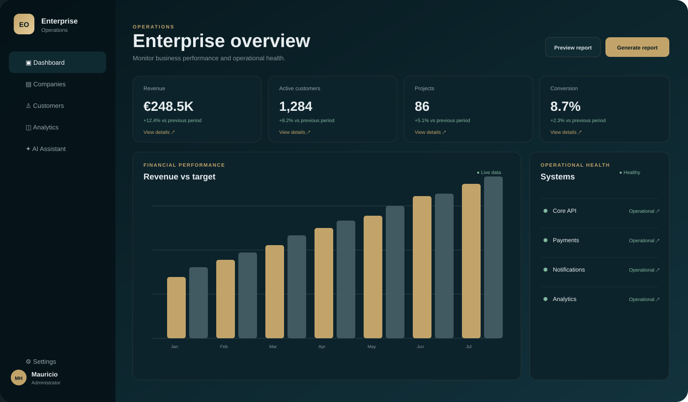

# Enterprise Operations Dashboard

> Senior-oriented React enterprise dashboard showcasing operational analytics, interactive workflows and an AI-ready frontend architecture.

A production-oriented React + TypeScript dashboard for enterprise operations, analytics and AI-assisted decision support.

## Stack
React, TypeScript, Vite, TanStack Query, Zustand, React Router, Zod, Recharts, Vitest and GitHub Actions.

## Architecture
Feature-oriented frontend with clear boundaries between application, business features, shared UI and infrastructure.

## Evolution
This project is intentionally built as an evolving engineering system. The history will show the progression from a clean foundation to domain features, API integration, quality automation and AI-assisted operations.

## Run
npm install
npm run dev

## Quality
npm run lint
npm run typecheck
npm run test
npm run build

## Roadmap
- Authentication and RBAC
- Customer and project management
- Operational analytics
- API integration
- Audit trail
- AI operations assistant
- E2E coverage
